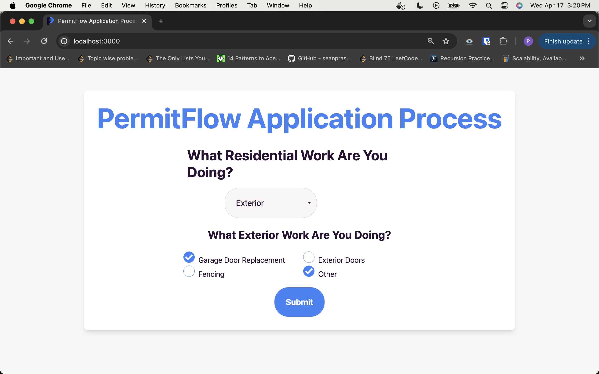

# PermitFlow Assessment

## Objective

The objective of this project was to design a Questionaire for contractors to determine if a permit is needed & what steps do they need to get approval for their renovation. It uses the following tech stack:

* Next.js
* React
* Node.js
* TypeScript
* Tailwind
* tRPC
* Prisma
* Zod
* PostgreSQL
* pgAdmin (optional)

## Screenshots

|  | 
|:--:| 
| *File Hierarchy* |

|  | 
|:--:| 
| *Initial Questionaire Page* |

|  | 
|:--:| 
| *Questionaire Page with all options for User* |

|  | 
|:--:| 
| *Result Page showing user next steps* |

|  | 
|:--:| 
| *pgAdmin showcasing new entry into database* |

## Video Demo

[](https://www.youtube.com/watch?v=VIDEO_ID)

Click the image above to watch a video demo of the project.

## Setup Instructions

### Containers

There are Postgres and Redis containers. To spin them up, use:

```
docker compose up -d
```

which will start a Postgres container on `localhost:5432` and a Redis container on `localhost:6379`.

### Starting the dev server

```bash
npm i
npm run dev
```

Open [http://localhost:3000](http://localhost:3000) with your browser to see the result.

### IDE

Any IDE/Code Editor of your choice will suffice, but my recommendation is Visual Studio Community. 

Official Microsoft Mirror: https://visualstudio.microsoft.com/downloads/


Clone/Download from the repository and execute the .sln file. The command line message will guide you through the program

## Author

Paarth Arora

e: paarth.arora21@gmail.com

p: 437-937-1942
